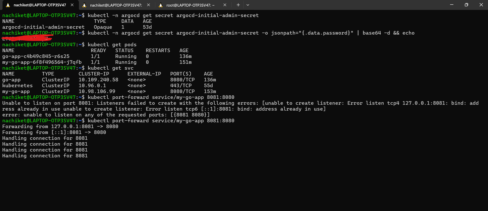
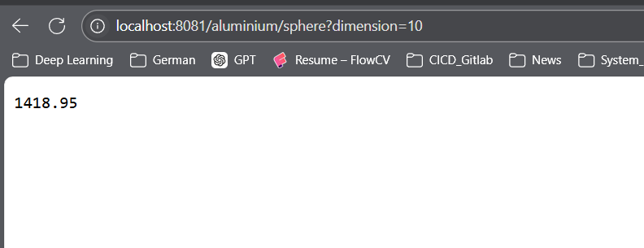
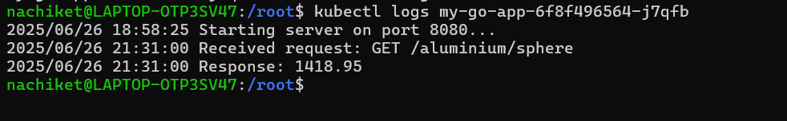
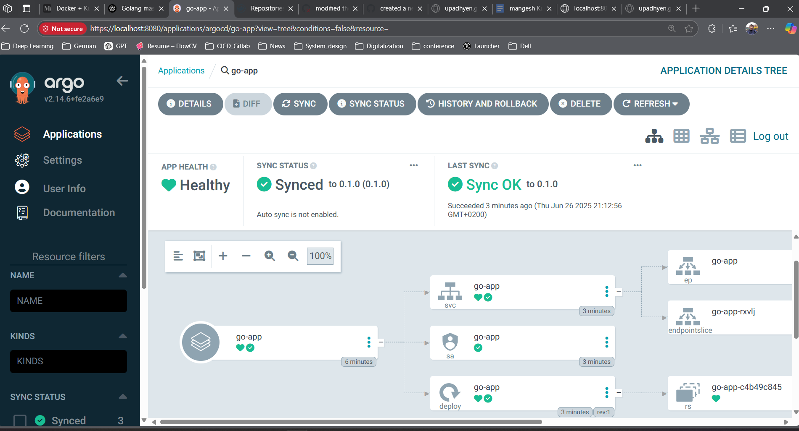

# Folder format
- main.go
- Dockerfile and .dockerignore file
- go-app: is the helm chart for the deployment

## How did I solve this
1. Finish the Go code: Added struct and interfaces which are used to find volume of Sphere
2. Tested Locally as go code. Did not created .exe file

`Note: later I added some logging and liveness and readiness probe as a good practice`

3. Created and build docker image
### Docker Image

As the task was to reduce the image size, I used multi staging build. First used Go image to build the file and then used alpine based image to deploy it. This reduced the size from 800MB to 25MB. Also added .dockeringnore file to speed up the build time.

This can be further be reduced by

- Trying out with smaller images
- Removing layers by running commands Parallely
- Using Scratch image, this is best way but you have to add lot of things to scratch image.


4. Push the image to docker hub. Can be found here [Link](https://hub.docker.com/repository/docker/megladonen/go-app/general)

5. Intialised a helm chart. Then change the configuration for adding my image. If you want to change the port while running the helm command you can use something like this.

```
helm upgrade --install go-app ./helm-chart \
  --namespace go-app \
  --set service.port=8080 \
  --set image.tag=v2.0.0
```
6. Tested everything on Minikube cluster. used port-forward command to see if we can interact with the application.



7. Wrapped everything in .tgz file.

## bonus
1. Added liveness and readiness probe and logging. Modified the helm chart to accomodate that.


2. CICD for .go and Dockerfile in github actions. This way whenever we push go code or change something in the Dockerfile. the new image will get deployed to the Docker hub. Can be found here [link](https://github.com/UpadhyeN/tv-test/blob/main/.github/workflows/main.yml)

3. I have tried adding security job but it is not working. 

4. Since we are using helm, we can leverage it to create a Argocd application. This way we can have single source of truth for git. Application is deployed with UI, This can also be done by .yaml file.

